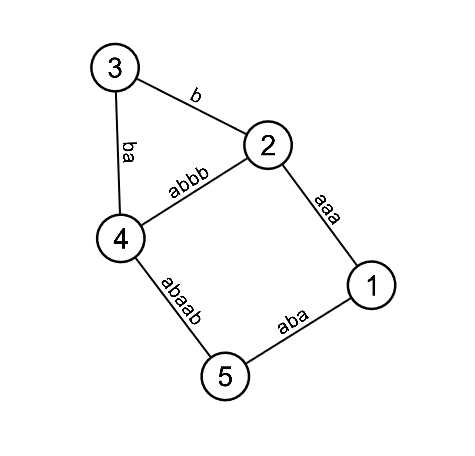

# drawgraph - tool for graph visualisation

Drawgraph reads list of edges and draws graph (as in graph theory, not graph of a function). Designed for competitive programming and solving graph theory problems.
It is written in C++17 and uses SFML library.

## Instalation

Drawgraph doesn't require installation. If you are on 64bit Linux chances are you will be able to run provided executable together with font folder.
Alternatively you can build drawgraph yourself.

## Building

If your system supports makefiles and you have g++ compiler installed, you can use provided Makefile. You need to install [SFML](https://github.com/SFML/SFML).
If you are on Windows, you might consider installing Linux Subsystem for Windows.

## Usage

```
./drawgraph < o
```
where ``` o ``` is file describing graph in format shown below.
First line must contain integers  n  and m separated by space. Next m lines follow each in format: integeres u, v and optionally string s.
This means that there is an undirected edge between u and v with optional weigth s. If all u and v are between 0 and n - 1 or 1 and n there will be excatly n verticies,
otherwise number of verticies depends only on given edges.

### Example

For following input drawgraph draws following image
```
5 6
1 2 aaa
2 3 b
3 4 ba
4 5 abaab
5 1 aba
2 4 abbb
```


